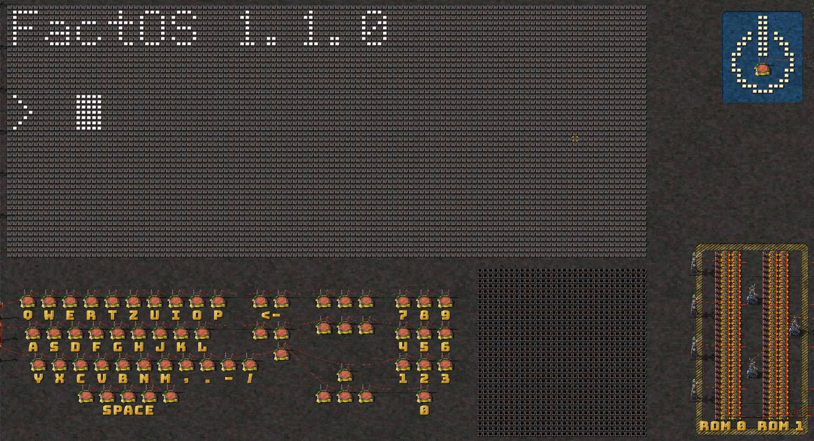
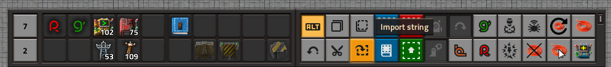

# FactoRISCo V - Factorio RISC-V CPU
This repository contains the code for the Factorio CPU, including an assembler and a python simulator.


### Specs of the CPU
- 5 Stage Pipelined Architektur
- 32 General Purpose Register
- 64 kB RAM
- 128 kB Hard Drive
 -Interrupt Handler
- ~700 Hz Taktfrequenz
- Peripherie
  - ASCII Character Display
  - Color Display 
  - Tastatur
  - RNG
# Assembler Installation
- We recommend the `uv` [Python Environment manager](https://docs.astral.sh/uv/guides/install-python/). Once installed, use `uv sync` to get the python environment. 

# CPU Installation
- You need Factorio (main game, not the Space Age expansion). You can get it on steam:
[Steam Link](https://store.steampowered.com/app/427520/Factorio/)

- Place the save file `factoriscoV3_official.zip` (from the main folder of this repository) into your saves folder. You can find the folder using [this](https://wiki.factorio.com/Application_directory) article.
- Open Factorio and load the world. Confirm to load the needed mods.
- You should be in the map editor (window top right corner, and missing character). If not, enter the map editor by pressing `Ctrl` + `Shift` + `F11` in-game.
- Change the simulation speed to 64x (or less if your machine does not support that much speed up) by checking out the Time tab of the map editor
- It is recommended to add the UPS counter by pressing `F4` to open the Debug Settings and enable `show-fps`
- If the clouds are going crazy, disable them in the main settings (`Esc` > `Settings`> `Graphics` > `Show clouds`)
- Hit the power button, the terminal should appear
- For a debug program, enter `R0` in the editor using the keyboard of the CPU (and press one of the 3 buttons symbolizing the `Enter` key).
- It should print 10 Fibonacci numbers, starting from 2.

# FactOS: Command Line Interface
The command line interface called `FactOS` is attached to the file system `Chest32`. Currently, there is no current working directory, instead you have to enter always the absolute path to a file or a folder.
Pay attention to the syntax, they are a bit quirky... (TODO: Make better syntax)

`FactOS`has currently the following commands implemented:
- `CLS`: Clears the screen
- `R0`: Runs the program currently loaded in ROM 0
- `R1`: Runs the program currently loaded in Rom 1
- `LS <path>`: List the contents of a folder. Example: `LS /BIN` or `LS /` (for the root folder, the single `/` is mandatory)
- `MKDIR <path> <folder name>`: Creates a folder in the given folder path with name `<folder name>`. Max. 8 chars are allowed for a folder name. Example: `MKDIR / test` creates a test folder in the root dir.
- `TOUCH <path> <file name>`: Same as MKDIR, but creates an empty file instead. Example: `TOUCH /BIN EXAMPLE` creates a file `/BIN/EXAMPLE`
- `CPROM <ROM index> <file name>`: Copies the content of the User Rom to a file. the File must exist (use `TOUCH` for that). Example: `CPROM 0 /BIN/EXAMPLE`
- `RUN <path>`: Executes the program given by the path. Example: `RUN /BIN/EXAMPLE`
- `RM <path>`: Removes a file or a directory. The directory must be empty to remove it. Currently, there is no recursive mode implemented. Example: `RM /BIN/EXAMPLE`
- `FSINIT`: Formats the complete file system. The CPU will stop working and you have to restart the computer (power on -> power off).

# How to use the Assembler
You need to write an assembler program. An example is given in `factosico_v_assembly/fib_5.s` in this repository. The CPU uses mainly the RISC-V ISA, a (not the best documented, TODO) spreadsheet of the ISA is here:
[ISA Spreadsheet](https://docs.google.com/spreadsheets/d/1yiPG3cVLzHdQ5oheNkY_mfr2utxFd6-CcddI-NiuWIM/edit?usp=sharing)

However, an overview of the assembly language is planned (TODO).

Once you have an assembly program, you can assemble it using the `factorisco_assembler/assembler.py` script. For that, update the script by giving the file name of your program (inside the `factorisco_v_assembly` folder, without the .s extension)
Example:
```
if __name__ == "__main__":
    verbose = False
    user_program("fib_5", verbose=verbose)
```
Then, run the assembler from the root directory of this repo:
```
python factorisco_assembler/assembler.py
```
TODO: better command line interface for the assembler

The assembler should print out a long string of the "Data Blueprint".
Copy that string (you can mark the whole line by clicking 3 times on it for most editors).

Then, open Factorio and press the "Import String" button in the bottom row:


Paste the copied string. A column of constant combinators should be loaded.
Insert them either as the left column of ROM 0 or ROM 1.

Then, you can run the program by entering R0 or R1 inside the CPU terminal.